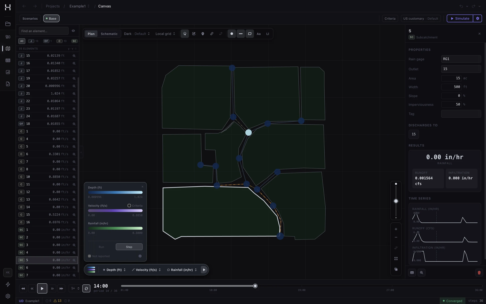
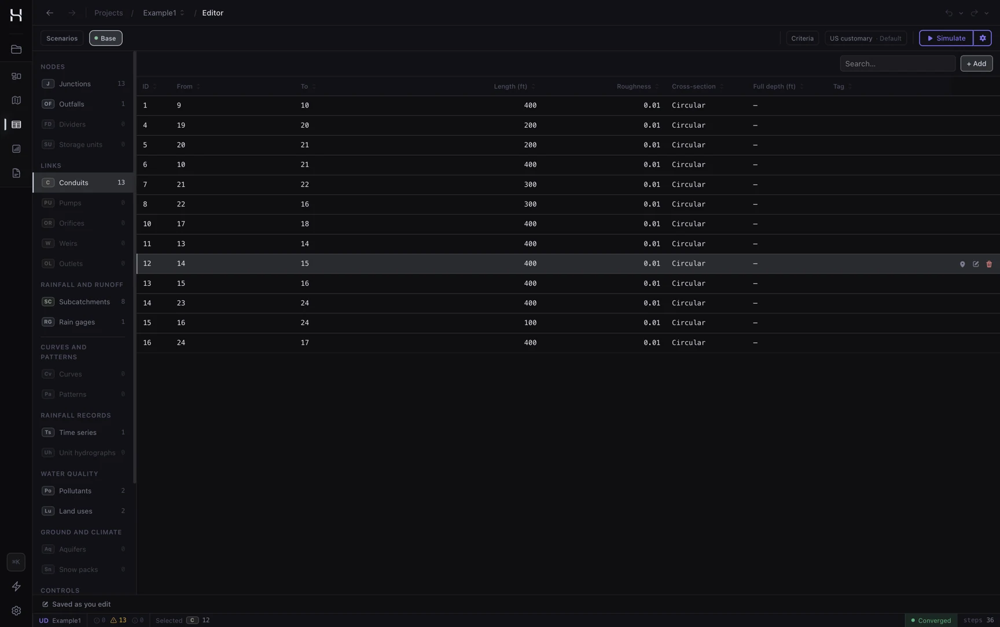
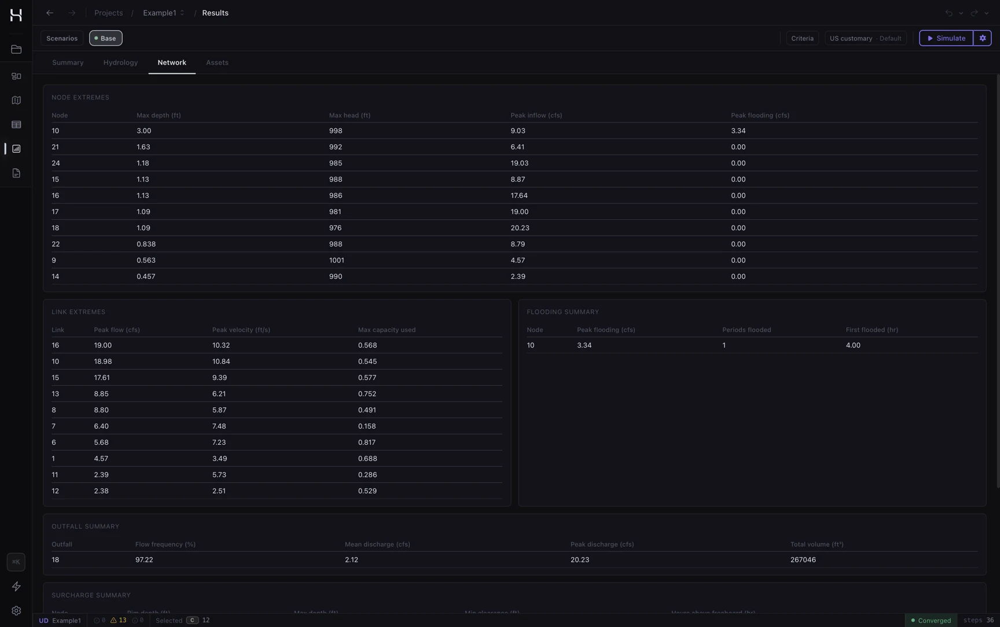
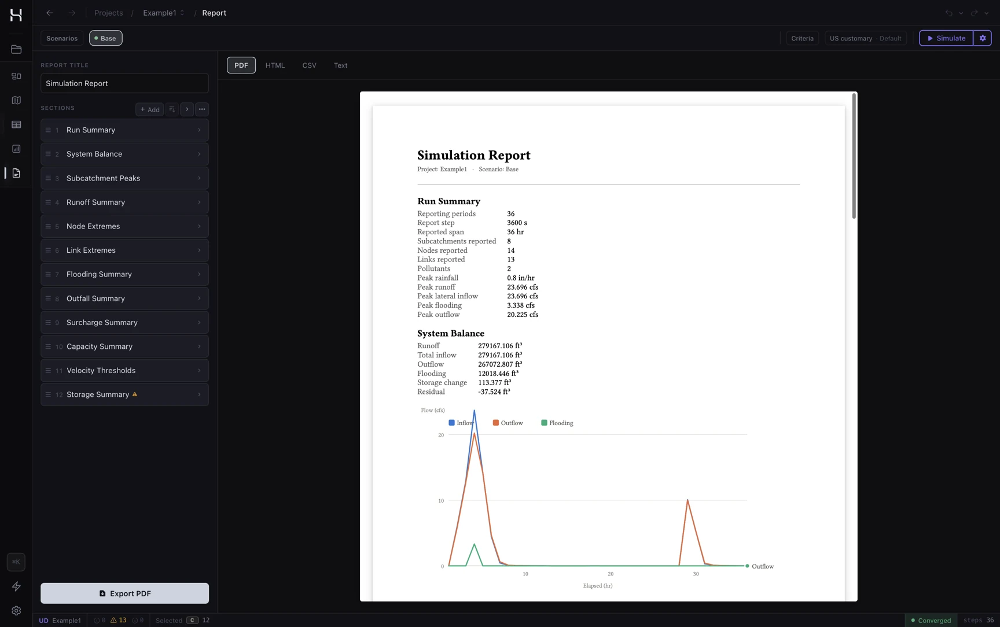
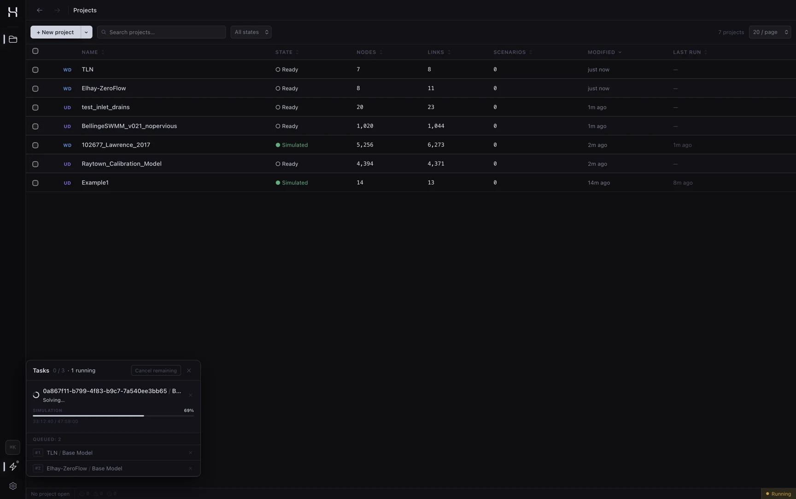

# Hydra

[](https://github.com/neeraip/hydra/releases?q=Hydra+Library&expanded=true)
[](https://github.com/neeraip/hydra/releases?q=Hydra+CLI&expanded=true)
[](https://github.com/neeraip/hydra/releases?q=Hydra+GUI&expanded=true)
[](https://github.com/neeraip/hydra/actions/workflows/cargo-ci.yml)
[](#license)

Hydra is a water infrastructure simulation platform written in Rust. It is built as a suite of domain engines sharing one toolchain: a desktop GUI, a `hydra` CLI, and a Rust SDK.

Correctness is defined by conservation laws and Hydra's own convergence criteria rather than by agreement with a reference implementation. Where Hydra departs from the code its data model comes from, the departure is deliberate, documented in the owning specification, and explained.

| Engine | Domain | Source model |
|---|---|---|
| **Water Distribution** (`wds`) | Pressurised supply networks: hydraulics, water quality, energy | EPANET `.inp` (2.x) |
| **Urban Drainage** (`uds`) | Stormwater and wastewater collection: runoff, routing, quality | SWMM `.inp` |

Both engines run from all three surfaces, and model *editing* in the desktop app covers both: a drainage project is created by importing a SWMM model, then edited like any other: network elements, hydrology, pollutants and LID controls.

**[→ Try it in your browser](https://neeraip.github.io/hydra/try/)** · **[→ Download](https://github.com/neeraip/hydra/releases/latest)** · **[→ Full documentation](https://neeraip.github.io/hydra/docs/)**

The browser demo runs the real engines, compiled to WebAssembly: drop an EPANET or SWMM model (or pick a bundled example) and read the same report the CLI prints. Everything runs in your tab. Models are never uploaded. Each library release also attaches it as a single `hydra-try-<version>.html` you can keep and run offline.



<sub>The canvas: the network in plan, results played back in time.</sub>

## Water distribution engine

Extended-period simulation (EPS) of hydraulic behaviour and water quality dynamics across pressurised pipe networks, computing the full time history of flows, pressures, and constituent concentrations at every node and link.

- **Hydraulics:** GGA solver, Hazen-Williams / Darcy-Weisbach / Chezy-Manning head loss, DDA and PDA demand models, pumps, all EPANET valve types, FAVAD leakage, rule-based controls
- **Water quality:** chemical constituent, water age, source tracing; Lagrangian transport; bulk and wall reactions; all EPANET tank mixing models
- **I/O:** all 11 EPANET flow unit systems; `.out` binary, `.rpt` text, `.json` report output

Inputs are EPANET `.inp` files (local or via HTTP URL), any 2.x release, since the constructs 2.3 added are optional. Outputs are an EPANET-compatible binary `.out` file and a plain-text or JSON `.rpt` report.

## Urban drainage engine

Continuous and event simulation of stormwater and wastewater collection systems on the SWMM data model: rainfall-runoff with Horton / Green-Ampt / Curve Number infiltration, LID controls, snowmelt, groundwater and RDII; Preissmann-slot dynamic-wave routing through conduits, pumps, orifices, weirs, outlets and street inlets; two-dimensional overland flow on an unstructured triangular mesh; pollutant buildup, washoff, treatment, and network transport; rule-based controls with PID modulation.

The surface and the pipes work as dual drainage. Inlets drain a flooded street into a sewer running part full, a subcatchment can discharge onto the surface instead of at a node, and pollutants travel across the surface and exchange with the network.

Inputs are SWMM `.inp` files; outputs are a SWMM-compatible binary `.out` file and a text report (a mesh model also writes its surface results to a `.2d.out` sidecar). Routing runs in parallel when the model's own `THREADS` option asks for width, with results byte-identical at any width. Available from the CLI (`hydra run model.inp`; the model's own sections identify the engine), the SDK (the `hydra::uds` module), and the desktop app, where a drainage model can be imported, edited, run and explored.

## The desktop app

| | |
|---|---|
| <br><sub>**The editor.** Every element in tables built for bulk edits.</sub> | <br><sub>**Results.** Node and link extremes, flooding and outfall summaries.</sub> |
| <br><sub>**The report builder.** Charts and tables from saved templates.</sub> | <br><sub>**The run queue.** Simulations solve in the background while you work.</sub> |

## Install

### GUI

Download the installer for your platform from the [releases page](https://github.com/neeraip/hydra/releases/latest).

### CLI

**Pre-built binary** (no Rust required): download from the [releases page](https://github.com/neeraip/hydra/releases/latest).

**Cargo:**

```sh
cargo install hydra-cli
```

**Basic usage:**

```sh
hydra run network.inp                                     # summary to stdout
hydra run network.inp --summary report.rpt --results output.out
hydra run https://example.com/network.inp --summary report.json
hydra engines                                             # engines this build provides
```

See [crates/cli/README.md](crates/cli/README.md) for the full option reference.

### SDK (Rust library)

```toml
[dependencies]
hydra-sdk = "17"
```

```rust
use hydra_sdk::{io, Simulation};

let network = io::parse(&std::fs::read("network.inp")?)?;
let mut sim = Simulation::create();
sim.load(network)?;
sim.run()?;
```

See the [SDK documentation](https://neeraip.github.io/hydra/docs/sdk/overview.html) for a full usage guide.

## Build from source

Prerequisites: Rust ≥ 1.95, [`just`](https://just.systems/).  
GUI only: Node.js 24, pnpm 11, Tauri CLI.

```sh
git clone https://github.com/neeraip/hydra.git
cd hydra
just build
just test
```

See [CONTRIBUTING.md](.github/CONTRIBUTING.md) for the full development setup.

## Documentation

| | |
|---|---|
| [Engines](https://neeraip.github.io/hydra/docs/engines.html) | The domain engines, what each covers, and what ships today |
| [Getting Started](https://neeraip.github.io/hydra/docs/getting-started/installation.html) | Installation, build, CLI, GUI |
| [SDK](https://neeraip.github.io/hydra/docs/sdk/overview.html) | Library usage and examples |
| [Architecture](https://neeraip.github.io/hydra/docs/architecture/crates.html) | Crate layout and specifications |
| [Reference](https://neeraip.github.io/hydra/docs/reference/inp-format.html) | INP format, performance, EPANET migration |

## Contributing

Contributions are welcome. Please read [CONTRIBUTING.md](.github/CONTRIBUTING.md) before opening a pull request, in particular the **Spec First** workflow, which requires spec changes to land before implementation changes for any solver, model, or analytics work.

## License

Hydra is published under the [GNU Affero General Public License v3.0](LICENSE), with a
[commercial license](COMMERCIAL_LICENSE.md) available for the cases the AGPL does not fit.

Using Hydra asks nothing of you. Run the CLI, drive it from a script, model in the desktop app, or
change it for your own purposes. Your models and your results stay yours, and you may use them
commercially.

The AGPL governs building Hydra into something you distribute: linking the crates into your own
application and shipping it, or running a modified Hydra as a network service. Calling `hydra` as a
separate program is use, not incorporation. If that reciprocity does not suit, the
[commercial license](COMMERCIAL_LICENSE.md) grants the same rights without it.

The [license text](LICENSE) is what governs, and a case near the line deserves a lawyer.
